# RMS Relational Database & Connection Architecture Blueprint (Upgraded)

This document provides a comprehensive, high-fidelity blueprint of the Resource Management System (RMS) relational database schema, database-level indices, SQLAlchemy model configurations, relationship wiring, API routers, and metrics engines.

---

## 1. Database Schema & Entity Layout

The database runs on PostgreSQL. The DDL schema is defined in [schema.sql](file:///d:/MagnificIT/resource-portal-rebuilt/backend/sql/schema.sql) and mapped via SQLAlchemy in [database.py](file:///d:/MagnificIT/resource-portal-rebuilt/backend/app/models/database.py).

```mermaid
erDiagram
    %% Identity & Security
    roles ||--o{ role_permissions : "role_id"
    permissions ||--o{ role_permissions : "permission_id"
    roles ||--o{ users : "role_id"
    users ||--o| resources : "resource_id"
    users ||--o{ sessions : "user_id"

    %% Resource Profile Details
    resources ||--o| resource_addresses : "address"
    resources ||--o| resource_bank_details : "bank_details"
    resources ||--o| resource_emergency_contacts : "emergency_contact"
    resources ||--o{ resource_documents : "documents"
    resources ||--o{ resource_skills : "resource_skills"
    skills_master ||--o{ resource_skills : "skill_id"
    users ||--o{ document_attachments : "uploaded_by"

    %% Master Tables references
    countries ||--o{ states : "country_id"
    states ||--o{ cities : "state_id"
    resource_addresses }|--|| cities : "city_id"
    resource_addresses }|--|| countries : "citizen_of_id"
    resources }|--|| designations : "designation_id"
    resources }|--|| departments : "department_id"
    resources }|--|| resource_statuses : "status_id"

    %% Commercials
    clients ||--o{ projects : "client_id"
    projects }|--|| project_statuses : "status_id"
    projects ||--o{ project_resources : "project_id"
    resources ||--o{ project_resources : "resource_id"

    %% AI Planner & Wizard
    projects ||--o{ project_requirements : "requirements"
    project_requirements ||--o{ project_skill_requirements : "requirement_id"
    skills_master ||--o{ project_skill_requirements : "skill_id"
    projects ||--o{ project_assignments : "assignments"
    project_requirements ||--o{ project_assignments : "requirement_id"
    resources ||--o{ project_assignments : "resource_id"
    projects ||--o{ ai_analysis_results : "ai_analysis_results"

    %% Task Execution & Workload
    projects ||--o{ project_tasks : "project_tasks"
    project_requirements ||--o{ project_tasks : "requirement_id"
    resources ||--o{ project_tasks : "resource_id"
    project_tasks ||--o{ task_dependencies : "task_id"
    project_tasks ||--o{ task_schedule_entries : "task_id"
    resources ||--o{ task_schedule_entries : "resource_id"
    project_tasks ||--o{ task_time_logs : "task_id"
    resources ||--o{ task_time_logs : "resource_id"
    project_tasks ||--o{ task_activity_logs : "task_id"
    resources ||--o{ task_activity_logs : "resource_id"

    %% General Tasks & Discussions
    projects ||--o{ tasks : "tasks"
    resources ||--o{ tasks : "tasks"
    tasks }|--|| task_statuses : "status_id"
    tasks ||--o{ task_comments : "comments"
    users ||--o{ task_comments : "user_id"

    %% Leaves Management
    resources ||--o{ leaves : "leaves"
    leave_types ||--o{ leaves : "leave_type_id"
    resources ||--o{ leave_balances : "balances"
    leave_types ||--o{ leave_balances : "leave_type_id"

    %% Timesheets Management
    resources ||--o{ timesheets : "timesheets"
    timesheets ||--o{ timesheet_entries : "entries"
    projects ||--o{ timesheet_entries : "project_id"

    %% Workflow Approvals Engine
    approval_workflows ||--o{ approval_workflow_steps : "workflow_id"
    roles ||--o{ approval_workflow_steps : "role_id"
    users ||--o{ approvals : "submitted_by/approved_by"

    %% Payroll
    resources ||--o{ payslips : "payslips"
    document_attachments ||--o| payslips : "file_attachment_id"

    %% Bulletins & Settings
    users ||--o{ announcements : "created_by"
    document_attachments ||--o| report_exports : "attachment_id"
    users ||--o{ report_exports : "requested_by"

    %% Audit & Logging
    users ||--o| audit_logs : "user_id"

    %% History Archives
    resources ||--o{ resource_history : "resource_id"
    projects ||--o{ project_history : "project_id"
    tasks ||--o{ task_history : "task_id"
    resource_documents ||--o{ document_history : "resource_document_id"
    document_attachments ||--o{ document_history : "old/new_attachment_id"

    %% Notifications Infrastructure
    users ||--o{ notifications : "recipient_id"
    notifications ||--o{ notification_logs : "notification_id"

    %% Daily Reporting & Feedback
    resources ||--o{ daily_reports : "daily_reports"
    projects ||--o{ daily_reports : "daily_reports"
    daily_reports ||--o{ daily_report_items : "items"
    project_tasks ||--o{ daily_report_items : "task_id"
    daily_reports ||--o| report_analysis_results : "analysis_result"
    daily_reports ||--o{ report_flags : "flags"
```



### Lookup & Master Lookup Tables
These tables hold reference domains, configurations, and system-wide state classifications:
1. `countries`: Country definitions with unique names and standard ISO codes.
2. `states`: State lookup records linked to a parent country, guarded by a unique constraint of name + country.
3. `cities`: City lookup records linked to a parent state, guarded by a unique state + city constraint.
4. `departments`: Functional business units (e.g., Engineering, Sales, HR).
5. `designations`: Core employee corporate titles linked to resource structures.
6. `skills_master`: Centralized master list of skill names and categories.
7. `document_types`: Reference directory of upload folders (e.g., CV, Passport Copy, Visa Copy).
8. `leave_types`: System-wide leave types configured with default paid status and allowance duration.
9. `task_statuses`: General task tracking states (e.g., `pending`, `in-progress`, `completed`, `wanting-requirements`).
10. `resource_statuses`: Onboarding states for developers (e.g., `pending`, `active`, `resigned`, `terminated`).
11. `project_statuses`: Commercial project lifecycle categories (e.g., `active`, `completed`, `on-hold`).
12. `notification_types`: Categories of notification alerts (e.g., `info`, `alert`, `warning`, `reminder`).

---

## 2. Table Schemas & Configurations

This section lists the exact structures, constraints, indices, and relationships of every table in the PostgreSQL database.

### A. Lookup & Master Lookup Layer

#### `countries` (Global Countries lookup)
* `id` (UUID, Primary Key, Default: `uuid_generate_v4()`)
* `name` (VARCHAR(100), Unique, Not Null)
* `iso_code` (VARCHAR(3), Unique, Not Null)

#### `states` (States/Provinces lookup)
* `id` (UUID, Primary Key, Default: `uuid_generate_v4()`)
* `country_id` (UUID, Foreign Key referencing `countries.id` with `ON DELETE CASCADE`, Not Null)
* `name` (VARCHAR(100), Not Null)
* `state_code` (VARCHAR(10), Nullable)
* **Constraints**: `uq_state_country` (Unique on `country_id` and `name`)

#### `cities` (Local Cities lookup)
* `id` (UUID, Primary Key, Default: `uuid_generate_v4()`)
* `state_id` (UUID, Foreign Key referencing `states.id` with `ON DELETE CASCADE`, Not Null)
* `name` (VARCHAR(100), Not Null)
* **Constraints**: `uq_city_state` (Unique on `state_id` and `name`)

#### `departments` (Corporate Divisions)
* `id` (UUID, Primary Key, Default: `uuid_generate_v4()`)
* `name` (VARCHAR(100), Unique, Not Null)
* `description` (TEXT, Nullable)
* `is_active` (BOOLEAN, Default: `TRUE`, Not Null)

#### `designations` (Role Titles)
* `id` (UUID, Primary Key, Default: `uuid_generate_v4()`)
* `title` (VARCHAR(100), Unique, Not Null)
* `description` (TEXT, Nullable)
* `is_active` (BOOLEAN, Default: `TRUE`, Not Null)

#### `skills_master` (Master Skills Directory)
* `id` (UUID, Primary Key, Default: `uuid_generate_v4()`)
* `name` (VARCHAR(100), Unique, Not Null)
* `category` (VARCHAR(50), Nullable)

#### `document_types` (Reference Folders)
* `id` (UUID, Primary Key, Default: `uuid_generate_v4()`)
* `name` (VARCHAR(50), Unique, Not Null)
* `description` (TEXT, Nullable)

#### `leave_types` (Annual Allowance Limits)
* `id` (UUID, Primary Key, Default: `uuid_generate_v4()`)
* `name` (VARCHAR(50), Unique, Not Null)
* `max_days_allowed` (INT, Default: `0`, Not Null)
* `is_paid` (BOOLEAN, Default: `TRUE`, Not Null)

#### `task_statuses` (General Task Stages)
* `id` (UUID, Primary Key, Default: `uuid_generate_v4()`)
* `name` (VARCHAR(50), Unique, Not Null) - e.g., `'pending'`, `'in-progress'`, `'completed'`, `'wanting-requirements'`

#### `resource_statuses` (Resource Lifecycles)
* `id` (UUID, Primary Key, Default: `uuid_generate_v4()`)
* `name` (VARCHAR(50), Unique, Not Null) - e.g., `'pending'`, `'active'`, `'resigned'`, `'terminated'`

#### `project_statuses` (Commercial Projects Lifecycles)
* `id` (UUID, Primary Key, Default: `uuid_generate_v4()`)
* `name` (VARCHAR(50), Unique, Not Null) - e.g., `'active'`, `'completed'`, `'on-hold'`

#### `notification_types` (Alert Types)
* `id` (UUID, Primary Key, Default: `uuid_generate_v4()`)
* `name` (VARCHAR(50), Unique, Not Null) - e.g., `'info'`, `'alert'`, `'warning'`, `'reminder'`

---

### B. Security & Identity Layer

#### `roles` (User Roles)
* `id` (UUID, Primary Key, Default: `uuid_generate_v4()`)
* `name` (VARCHAR(50), Unique, Not Null) - e.g., `'Super Admin'`, `'Admin'`, `'Developer'`
* `description` (VARCHAR(255), Nullable)

#### `permissions` (System Access Permissions)
* `id` (UUID, Primary Key, Default: `uuid_generate_v4()`)
* `name` (VARCHAR(100), Unique, Not Null)
* `description` (VARCHAR(255), Nullable)

#### `role_permissions` (Roles and Permissions Bridge)
* `role_id` (UUID, Primary Key, Foreign Key referencing `roles.id` with `ON DELETE CASCADE`)
* `permission_id` (UUID, Primary Key, Foreign Key referencing `permissions.id` with `ON DELETE CASCADE`)

#### `resources` (Resource Details & Statuses)
Holds standard metadata and compliance criteria for onboarding.
* `id` (UUID, Primary Key, Default: `uuid_generate_v4()`)
* `employee_id` (VARCHAR(50), Unique, Not Null)
* `full_name` (VARCHAR(150), Not Null)
* `designation_id` (UUID, Foreign Key referencing `designations.id`, Not Null)
* `department_id` (UUID, Foreign Key referencing `departments.id`, Not Null)
* `email` (VARCHAR(255), Unique, Not Null)
* `phone` (VARCHAR(25), Nullable)
* `dob` (DATE, Nullable)
* `ni_number` (VARCHAR(30), Unique, Nullable)
* `status_id` (UUID, Foreign Key referencing `resource_statuses.id`, Not Null)
* `avatar_url` (TEXT, Nullable)
* `weekly_allowed_hours` (INT, Default: `35`, Not Null)
* `performance_notes` (TEXT, Nullable)
* `other_info` (TEXT, Nullable)
* `skillset` (TEXT, Nullable)
* `profile_completion_percentage` (INT, Default: `0`, Not Null)
* `onboarding_status` (VARCHAR(50), Default: `'pending'`, Not Null)
* `approval_status` (VARCHAR(50), Default: `'pending'`, Not Null)
* `passport_number` (VARCHAR(100), Nullable)
* `passport_expiry` (DATE, Nullable)
* `visa_number` (VARCHAR(100), Nullable)
* `visa_expiry` (DATE, Nullable)
* `nationality` (VARCHAR(100), Nullable)
* `is_deleted` (BOOLEAN, Default: `FALSE`, Not Null)
* `deleted_at` (TIMESTAMPTZ, Nullable)
* `deleted_by` (UUID, Foreign Key referencing `users.id`, Nullable)
* `created_at` (TIMESTAMPTZ, Default: `NOW()`, Not Null)
* `updated_at` (TIMESTAMPTZ, Default: `NOW()`, Not Null)

#### `users` (Identity Credentials)
* `id` (UUID, Primary Key, Default: `uuid_generate_v4()`)
* `username` (VARCHAR(100), Unique, Not Null)
* `password_hash` (VARCHAR(255), Not Null)
* `email` (VARCHAR(255), Unique, Not Null)
* `full_name` (VARCHAR(150), Nullable)
* `role_id` (UUID, Foreign Key referencing `roles.id`, Not Null)
* `resource_id` (UUID, Foreign Key referencing `resources.id` with `ON DELETE SET NULL`, Nullable)
* `is_active` (BOOLEAN, Default: `TRUE`, Not Null)
* `last_login` (TIMESTAMPTZ, Nullable)
* `created_at` (TIMESTAMPTZ, Default: `NOW()`, Not Null)
* `updated_at` (TIMESTAMPTZ, Default: `NOW()`, Not Null)

#### `sessions` (Session Tracking)
* `id` (UUID, Primary Key, Default: `uuid_generate_v4()`)
* `user_id` (UUID, Foreign Key referencing `users.id` with `ON DELETE CASCADE`, Not Null)
* `refresh_token` (VARCHAR(512), Unique, Not Null)
* `expires_at` (TIMESTAMPTZ, Not Null)
* `ip_address` (VARCHAR(45), Nullable)
* `user_agent` (VARCHAR(255), Nullable)
* `created_at` (TIMESTAMPTZ, Default: `NOW()`, Not Null)

---

### C. Resource Profile Relational Layer

#### `resource_addresses` (Physical Addresses)
* `id` (UUID, Primary Key, Default: `uuid_generate_v4()`)
* `resource_id` (UUID, Unique, Foreign Key referencing `resources.id` with `ON DELETE CASCADE`, Not Null)
* `current_address` (TEXT, Not Null)
* `city_id` (UUID, Foreign Key referencing `cities.id`, Not Null)
* `citizen_of_id` (UUID, Foreign Key referencing `countries.id`, Not Null)
* `previous_address` (TEXT, Nullable)
* `last_changed_at` (TIMESTAMPTZ, Nullable)
* `last_changed_by` (UUID, Foreign Key referencing `users.id` with `ON DELETE SET NULL`, Nullable)

#### `resource_emergency_contacts` (Emergency Contacts)
* `id` (UUID, Primary Key, Default: `uuid_generate_v4()`)
* `resource_id` (UUID, Unique, Foreign Key referencing `resources.id` with `ON DELETE CASCADE`, Not Null)
* `contact_name` (VARCHAR(150), Not Null)
* `phone` (VARCHAR(25), Not Null)
* `email` (VARCHAR(255), Nullable)
* `address` (TEXT, Nullable)

#### `resource_bank_details` (Bank Details)
* `id` (UUID, Primary Key, Default: `uuid_generate_v4()`)
* `resource_id` (UUID, Unique, Foreign Key referencing `resources.id` with `ON DELETE CASCADE`, Not Null)
* `bank_name` (VARCHAR(100), Not Null)
* `account_number` (VARCHAR(50), Not Null)
* `sort_code` (VARCHAR(20), Not Null)

#### `resource_skills` (Resource Skills Bridge)
* `resource_id` (UUID, Primary Key, Foreign Key referencing `resources.id` with `ON DELETE CASCADE`)
* `skill_id` (UUID, Primary Key, Foreign Key referencing `skills_master.id` with `ON DELETE CASCADE`)

#### `resource_documents` (Onboarding files & certificates)
* `id` (UUID, Primary Key, Default: `uuid_generate_v4()`)
* `resource_id` (UUID, Foreign Key referencing `resources.id` with `ON DELETE CASCADE`, Not Null)
* `document_type` (VARCHAR(50), Not Null)
* `file_name` (VARCHAR(255), Not Null)
* `file_path` (TEXT, Not Null)
* `uploaded_at` (TIMESTAMPTZ, Default: `NOW()`, Not Null)
* `uploaded_by` (UUID, Foreign Key referencing `users.id` with `ON DELETE SET NULL`, Nullable)

#### `document_attachments` (Static Binary Files)
Holds file attachments for payslips, documents, and dashboard bullet exports.
* `id` (UUID, Primary Key, Default: `uuid_generate_v4()`)
* `filename` (VARCHAR(255), Not Null)
* `storage_key` (VARCHAR(255), Unique, Not Null)
* `file_size` (INT, Not Null)
* `mime_type` (VARCHAR(100), Not Null)
* `uploaded_by` (UUID, Foreign Key referencing `users.id`, Not Null)
* `entity_type` (VARCHAR(50), Nullable)
* `entity_id` (UUID, Nullable)
* `created_at` (TIMESTAMPTZ, Default: `NOW()`, Not Null)

---

### D. Clients & Projects Layer

#### `clients` (Customer Directory)
* `id` (UUID, Primary Key, Default: `uuid_generate_v4()`)
* `name` (VARCHAR(150), Unique, Not Null)
* `contact_person` (VARCHAR(150), Nullable)
* `email` (VARCHAR(255), Nullable)
* `phone` (VARCHAR(25), Nullable)
* `address` (TEXT, Nullable)
* `is_deleted` (BOOLEAN, Default: `FALSE`, Not Null)
* `deleted_at` (TIMESTAMPTZ, Nullable)
* `deleted_by` (UUID, Foreign Key referencing `users.id`, Nullable)

#### `projects` (Contracts Directory)
* `id` (UUID, Primary Key, Default: `uuid_generate_v4()`)
* `name` (VARCHAR(150), Not Null)
* `client_id` (UUID, Foreign Key referencing `clients.id`, Not Null)
* `start_date` (DATE, Not Null)
* `end_date` (DATE, Nullable)
* `status_id` (UUID, Foreign Key referencing `project_statuses.id`, Not Null)
* `description` (TEXT, Nullable)
* `is_deleted` (BOOLEAN, Default: `FALSE`, Not Null)
* `deleted_at` (TIMESTAMPTZ, Nullable)
* `deleted_by` (UUID, Foreign Key referencing `users.id`, Nullable)

#### `project_resources` (Project Team Assignments Bridge)
* `project_id` (UUID, Primary Key, Foreign Key referencing `projects.id` with `ON DELETE CASCADE`)
* `resource_id` (UUID, Primary Key, Foreign Key referencing `resources.id` with `ON DELETE CASCADE`)

---

### E. AI Planner & Project Wizard Layer

#### `project_requirements` (AI Scoped Modules)
* `id` (SERIAL, Primary Key)
* `project_id` (UUID, Foreign Key referencing `projects.id` with `ON DELETE CASCADE`, Not Null)
* `module_name` (VARCHAR(255), Not Null)
* `description` (TEXT, Nullable)
* `estimated_hours` (INTEGER, Nullable)
* `priority` (VARCHAR(50), Nullable)
* `status` (VARCHAR(50), Default: `'pending'`, Not Null)
* `created_at` (TIMESTAMP, Default: `CURRENT_TIMESTAMP`, Not Null)

#### `project_skill_requirements` (Required Skill levels)
* `id` (SERIAL, Primary Key)
* `requirement_id` (INTEGER, Foreign Key referencing `project_requirements.id` with `ON DELETE CASCADE`, Not Null)
* `skill_id` (UUID, Foreign Key referencing `skills_master.id` with `ON DELETE CASCADE`, Not Null)
* `required_level` (VARCHAR(50), Nullable)
* `mandatory` (BOOLEAN, Default: `TRUE`, Not Null)

#### `project_assignments` (Module Allocation Records)
* `id` (SERIAL, Primary Key)
* `project_id` (UUID, Foreign Key referencing `projects.id` with `ON DELETE CASCADE`, Not Null)
* `requirement_id` (INTEGER, Foreign Key referencing `project_requirements.id` with `ON DELETE CASCADE`, Not Null)
* `resource_id` (UUID, Foreign Key referencing `resources.id` with `ON DELETE CASCADE`, Not Null)
* `assignment_type` (VARCHAR(50), Nullable)
* `assigned_by` (UUID, Foreign Key referencing `users.id` with `ON DELETE SET NULL`, Nullable)
* `assigned_at` (TIMESTAMP, Default: `CURRENT_TIMESTAMP`, Not Null)

#### `ai_analysis_results` (AI Analyzer Caches)
Stores prompts and parsing caches returned from OpenAI/DeepSeek analysis.
* `id` (UUID, Primary Key, Default: `uuid_generate_v4()`)
* `project_id` (UUID, Foreign Key referencing `projects.id` with `ON DELETE CASCADE`, Not Null)
* `prompt` (TEXT, Not Null)
* `response` (JSONB, Not Null)
* `model_name` (VARCHAR(100), Not Null)
* `created_at` (TIMESTAMP, Default: `CURRENT_TIMESTAMP`, Not Null)

---

### F. Detailed Task Execution Layer

#### `project_tasks` (Decomposed Tickets)
Detailed tasks generated by the AI planner.
* `id` (UUID, Primary Key, Default: `uuid_generate_v4()`)
* `project_id` (UUID, Foreign Key referencing `projects.id` with `ON DELETE CASCADE`, Not Null)
* `requirement_id` (INTEGER, Foreign Key referencing `project_requirements.id` with `ON DELETE CASCADE`, Not Null)
* `resource_id` (UUID, Foreign Key referencing `resources.id` with `ON DELETE SET NULL`, Nullable)
* `parent_task_id` (UUID, Foreign Key referencing `project_tasks.id` with `ON DELETE CASCADE`, Nullable)
* `task_name` (VARCHAR(255), Not Null)
* `description` (TEXT, Nullable)
* `estimated_hours` (INTEGER, Default: `0`, Not Null)
* `actual_hours` (INTEGER, Default: `0`, Not Null)
* `priority` (VARCHAR(50), Default: `'Medium'`, Nullable)
* `status` (VARCHAR(50), Default: `'pending'`, Nullable) - e.g., `'pending'`, `'in_progress'`, `'paused'`, `'completed'`
* `start_date` (DATE, Nullable)
* `end_date` (DATE, Nullable)
* `created_at` (TIMESTAMP, Default: `CURRENT_TIMESTAMP`, Not Null)

#### `task_dependencies` (Topological dependencies)
* `id` (UUID, Primary Key, Default: `uuid_generate_v4()`)
* `task_id` (UUID, Foreign Key referencing `project_tasks.id` with `ON DELETE CASCADE`, Not Null)
* `depends_on_task_id` (UUID, Foreign Key referencing `project_tasks.id` with `ON DELETE CASCADE`, Not Null)
* **Constraints**: `uq_task_dependency` (Unique on `task_id` and `depends_on_task_id`)

#### `task_schedule_entries` (Daily Calendar Schedule)
Allocates daily workloads for developers to render on heatmaps.
* `id` (UUID, Primary Key, Default: `uuid_generate_v4()`)
* `task_id` (UUID, Foreign Key referencing `project_tasks.id` with `ON DELETE CASCADE`, Not Null)
* `resource_id` (UUID, Foreign Key referencing `resources.id` with `ON DELETE CASCADE`, Not Null)
* `work_date` (DATE, Not Null)
* `planned_hours` (INTEGER, Default: `0`, Not Null)
* `status` (VARCHAR(50), Default: `'planned'`, Nullable)

#### `task_time_logs` (Actual Hours Logged)
* `id` (UUID, Primary Key, Default: `uuid_generate_v4()`)
* `task_id` (UUID, Foreign Key referencing `project_tasks.id` with `ON DELETE CASCADE`, Not Null)
* `resource_id` (UUID, Foreign Key referencing `resources.id` with `ON DELETE CASCADE`, Not Null)
* `hours_logged` (NUMERIC(5,2), Default: `0.00`, Not Null)
* `notes` (TEXT, Nullable)
* `logged_at` (TIMESTAMP, Default: `CURRENT_TIMESTAMP`, Not Null)

#### `task_activity_logs` (Timer states)
* `id` (UUID, Primary Key, Default: `uuid_generate_v4()`)
* `task_id` (UUID, Foreign Key referencing `project_tasks.id` with `ON DELETE CASCADE`, Not Null)
* `resource_id` (UUID, Foreign Key referencing `resources.id` with `ON DELETE SET NULL`, Nullable)
* `action` (VARCHAR(50), Not Null) - e.g., `'started'`, `'paused'`, `'completed'`, `'reopened'`
* `created_at` (TIMESTAMP, Default: `CURRENT_TIMESTAMP`, Not Null)

---

### G. Leave Management Layer

#### `leave_balances` (Allowance ledger)
* `id` (UUID, Primary Key, Default: `uuid_generate_v4()`)
* `resource_id` (UUID, Foreign Key referencing `resources.id` with `ON DELETE CASCADE`, Not Null)
* `leave_type_id` (UUID, Foreign Key referencing `leave_types.id`, Not Null)
* `balance` (INT, Default: `0`, Not Null)
* **Constraints**: `uq_res_leave_type` (Unique on `resource_id` and `leave_type_id`)

#### `leaves` (Leave applications)
* `id` (UUID, Primary Key, Default: `uuid_generate_v4()`)
* `resource_id` (UUID, Foreign Key referencing `resources.id` with `ON DELETE CASCADE`, Not Null)
* `leave_type_id` (UUID, Foreign Key referencing `leave_types.id`, Not Null)
* `from_date` (DATE, Not Null)
* `to_date` (DATE, Not Null)
* `total_days` (INT, Not Null)
* `reason` (TEXT, Nullable)
* `status` (VARCHAR(20), Default: `'pending'`, Not Null) - e.g., `'pending'`, `'approved'`, `'rejected'`
* `is_deleted` (BOOLEAN, Default: `FALSE`, Not Null)
* `deleted_at` (TIMESTAMPTZ, Nullable)
* `deleted_by` (UUID, Foreign Key referencing `users.id`, Nullable)
* `created_at` (TIMESTAMPTZ, Default: `NOW()`, Not Null)

---

### H. Timesheet Management Layer

#### `timesheets` (Timesheet Header)
Tracks timesheet submissions for individual developer weeks.
* `id` (UUID, Primary Key, Default: `uuid_generate_v4()`)
* `resource_id` (UUID, Foreign Key referencing `resources.id` with `ON DELETE CASCADE`, Not Null)
* `week_end_date` (DATE, Not Null)
* `status` (VARCHAR(20), Default: `'pending'`, Not Null) - e.g., `'pending'`, `'approved'`, `'rejected'`, `'deleted'`, `'in draft'`
* `is_deleted` (BOOLEAN, Default: `FALSE`, Not Null)
* `deleted_at` (TIMESTAMPTZ, Nullable)
* `deleted_by` (UUID, Foreign Key referencing `users.id`, Nullable)
* `created_at` (TIMESTAMPTZ, Default: `NOW()`, Not Null)

#### `timesheet_entries` (Daily Hours Mappings)
Normalized sub-items allocating hours for each project + date pair.
* `id` (UUID, Primary Key, Default: `uuid_generate_v4()`)
* `timesheet_id` (UUID, Foreign Key referencing `timesheets.id` with `ON DELETE CASCADE`, Not Null)
* `project_id` (UUID, Foreign Key referencing `projects.id`, Not Null)
* `work_date` (DATE, Not Null)
* `hours` (DECIMAL(4,2), Default: `0.00`, Not Null)
* `remarks` (TEXT, Nullable)
* **Constraints**: `uq_timesheet_proj_date` (Unique on `timesheet_id`, `project_id`, and `work_date`)

---

### I. Workflow Approvals Engine

#### `approval_workflows` (Workflow Schemas)
Defines approvals by system module name.
* `id` (UUID, Primary Key, Default: `uuid_generate_v4()`)
* `name` (VARCHAR(100), Unique, Not Null)
* `module_name` (VARCHAR(50), Not Null) - e.g., `'leaves'`, `'timesheets'`, `'resources'`
* `description` (TEXT, Nullable)

#### `approval_workflow_steps` (Steps and Roles mappings)
Defines approval stages and roles responsible.
* `id` (UUID, Primary Key, Default: `uuid_generate_v4()`)
* `workflow_id` (UUID, Foreign Key referencing `approval_workflows.id` with `ON DELETE CASCADE`, Not Null)
* `step_number` (INT, Not Null)
* `role_id` (UUID, Foreign Key referencing `roles.id`, Not Null)
* **Constraints**: `uq_workflow_step` (Unique on `workflow_id` and `step_number`)

#### `approvals` (Approval Ledger status)
Logs details of approvals, steps, and responses.
* `id` (UUID, Primary Key, Default: `uuid_generate_v4()`)
* `module_name` (VARCHAR(50), Not Null)
* `record_id` (UUID, Not Null)
* `current_step_number` (INT, Default: `1`, Not Null)
* `submitted_by` (UUID, Foreign Key referencing `users.id`, Not Null)
* `approved_by` (UUID, Foreign Key referencing `users.id`, Nullable)
* `status` (VARCHAR(20), Default: `'pending'`, Not Null) - e.g., `'pending'`, `'approved'`, `'rejected'`
* `remarks` (TEXT, Nullable)
* `created_at` (TIMESTAMPTZ, Default: `NOW()`, Not Null)
* `updated_at` (TIMESTAMPTZ, Default: `NOW()`, Not Null)

---

### J. Payroll Layer

#### `payslips` (Resource Payslips)
* `id` (UUID, Primary Key, Default: `uuid_generate_v4()`)
* `resource_id` (UUID, Foreign Key referencing `resources.id` with `ON DELETE CASCADE`, Not Null)
* `month` (VARCHAR(30), Not Null)
* `days` (INTEGER, Not Null)
* `notes` (TEXT, Nullable)
* `amount` (DECIMAL(10,2), Not Null)
* `file_attachment_id` (UUID, Foreign Key referencing `document_attachments.id`, Nullable)
* `is_deleted` (BOOLEAN, Default: `FALSE`, Not Null)
* `deleted_at` (TIMESTAMPTZ, Nullable)
* `deleted_by` (UUID, Foreign Key referencing `users.id` with `ON DELETE SET NULL`, Nullable)
* `created_at` (TIMESTAMPTZ, Default: `NOW()`, Not Null)

---

### K. Bulletins & Settings Layer

### G. Announcements Layer (Add Announcement Form & Dashboard)

#### `announcements` (System Announcements Bulletin)
Stores system-wide announcements posted by administrators or HR.
* `id` (UUID, Primary Key, Default: `uuid_generate_v4()`)
* `subject` (VARCHAR(255), Not Null)
* `message` (TEXT, Not Null)
* `date` (DATE, Not Null)
* `is_deleted` (BOOLEAN, Default: `FALSE`)
* `deleted_at` (TIMESTAMPTZ, Nullable)
* `deleted_by` (UUID, Foreign Key referencing `users.id` with `ON DELETE SET NULL`, Nullable)
* `created_by` (UUID, Foreign Key referencing `users.id` with `ON DELETE RESTRICT`, Not Null)

#### Polymorphic File Attachment Linking
Announcements do not contain a direct foreign key pointing to the `document_attachments` table. Instead, a **polymorphic mapping association** is used:
* Attachment records are stored in `document_attachments` with `entity_type = 'announcement'` and `entity_id = announcements.id`.
* The API endpoints automatically query and link the attachment when fetching or deleting an announcement.
* Replacing or deleting an announcement automatically removes the corresponding physical file from `backend/uploads` and updates database records using safe transaction rollbacks.

#### Database Migrations & Bootstrap Setup
The table schema is fully synchronized and validated by the backend bootstrap script [setup_db.py](file:///d:/MagnificIT/resource-portal-rebuilt/backend/setup_db.py). During startup, it automatically executes migration statements to align older schemas:
* Checks the presence of soft-delete columns via Postgres `information_schema.columns`.
* Runs `ALTER TABLE announcements ADD COLUMN IF NOT EXISTS is_deleted BOOLEAN NOT NULL DEFAULT FALSE`.
* Runs `ALTER TABLE announcements ADD COLUMN IF NOT EXISTS deleted_at TIMESTAMPTZ NULL`.
* Runs `ALTER TABLE announcements ADD COLUMN IF NOT EXISTS deleted_by UUID NULL REFERENCES users(id) ON DELETE SET NULL`.
* This guarantees that the table is properly constructed, connected, and backward-compatible.

#### `settings` (System Configurations)
* `key` (VARCHAR(100), Primary Key)
* `value` (TEXT, Not Null)
* `description` (VARCHAR(255), Nullable)

#### `report_exports` (Reports Exports history)
* `id` (UUID, Primary Key, Default: `uuid_generate_v4()`)
* `report_name` (VARCHAR(100), Not Null)
* `export_type` (VARCHAR(10), Not Null) - e.g., `'excel'`, `'csv'`, `'pdf'`
* `attachment_id` (UUID, Foreign Key referencing `document_attachments.id`, Not Null)
* `requested_by` (UUID, Foreign Key referencing `users.id`, Not Null)
* `created_at` (TIMESTAMPTZ, Default: `NOW()`, Not Null)

---

### L. Audit & Logging Layer

#### `audit_logs` (Data Mutation Logs)
Logs data changes and actions performed by administrators, HR, and users.
* `id` (UUID, Primary Key, Default: `uuid_generate_v4()`)
* `module` (VARCHAR(50), Not Null) - Mapped to the functional area (e.g. `'admin_users'`, `'user_management'`, `'timesheets'`, `'tasks'`).
* `action` (VARCHAR(50), Not Null) - Action tag (e.g. `'admin_created'`, `'user_deactivated'`, `'admin_password_reset'`).
* `table_name` (VARCHAR(50), Not Null) - Name of the updated table (e.g. `'users'`).
* `record_id` (UUID, Not Null) - Primary key of the modified row.
* `old_value` (JSONB, Nullable) - Pre-mutation row snapshot.
* `new_value` (JSONB, Nullable) - Post-mutation row snapshot.
* `changed_fields` (JSONB, Nullable) - Explicit diff of changed properties.
* `user_id` (UUID, Foreign Key referencing `users.id`, Nullable) - Account ID of the actor.
* `ip_address` (VARCHAR(45), Nullable)
* `user_agent` (VARCHAR(255), Nullable)
* `created_at` (TIMESTAMPTZ, Default: `NOW()`, Not Null)

#### Audit Logging module alignment
To prevent data fragmentation and keep the "Admin Activity" grid fully loaded with admin actions:
* The `admin_users` endpoints log admin additions and changes under `module="admin_users"`.
* The retrieval query fetches logs matching `AuditLog.module.in_(["admin_users", "user_management"])`.
* This ensures that both historic entries logged as `"user_management"` (such as developer onboarding/approvals) and new admin account updates display seamlessly.

#### `login_activities` (Security Audits)
* `id` (UUID, Primary Key, Default: `uuid_generate_v4()`)
* `username` (VARCHAR(100), Not Null)
* `status` (VARCHAR(20), Not Null) - e.g., `'success'`, `'failed_password'`, `'failed_username'`, `'locked'`
* `ip_address` (VARCHAR(45), Nullable)
* `user_agent` (VARCHAR(255), Nullable)
* `created_at` (TIMESTAMPTZ, Default: `NOW()`, Not Null)

---

### M. History Archives Layer

#### `resource_history` (Resource Profile changes log)
* `id` (UUID, Primary Key, Default: `uuid_generate_v4()`)
* `resource_id` (UUID, Foreign Key referencing `resources.id` with `ON DELETE CASCADE`, Not Null)
* `changed_by` (UUID, Foreign Key referencing `users.id`, Not Null)
* `previous_value` (JSONB, Not Null)
* `new_value` (JSONB, Not Null)
* `changed_fields` (JSONB, Not Null)
* `created_at` (TIMESTAMPTZ, Default: `NOW()`, Not Null)

#### `project_history` (Project changes log)
* `id` (UUID, Primary Key, Default: `uuid_generate_v4()`)
* `project_id` (UUID, Foreign Key referencing `projects.id` with `ON DELETE CASCADE`, Not Null)
* `changed_by` (UUID, Foreign Key referencing `users.id`, Not Null)
* `previous_value` (JSONB, Not Null)
* `new_value` (JSONB, Not Null)
* `changed_fields` (JSONB, Not Null)
* `created_at` (TIMESTAMPTZ, Default: `NOW()`, Not Null)

#### `task_history` (Task changes log)
* `id` (UUID, Primary Key, Default: `uuid_generate_v4()`)
* `task_id` (UUID, Foreign Key referencing `tasks.id` with `ON DELETE CASCADE`, Not Null)
* `changed_by` (UUID, Foreign Key referencing `users.id`, Not Null)
* `status_from` (VARCHAR(30), Not Null)
* `status_to` (VARCHAR(30), Not Null)
* `created_at` (TIMESTAMPTZ, Default: `NOW()`, Not Null)

#### `document_history` (Onboarding file uploads log)
* `id` (UUID, Primary Key, Default: `uuid_generate_v4()`)
* `resource_document_id` (UUID, Foreign Key referencing `resource_documents.id` with `ON DELETE CASCADE`, Not Null)
* `changed_by` (UUID, Foreign Key referencing `users.id`, Not Null)
* `old_attachment_id` (UUID, Foreign Key referencing `document_attachments.id`, Nullable)
* `new_attachment_id` (UUID, Foreign Key referencing `document_attachments.id`, Not Null)
* `version` (INT, Not Null)
* `created_at` (TIMESTAMPTZ, Default: `NOW()`, Not Null)

---

### N. Notification Infrastructure Layer

#### `notifications` (Real-Time In-App Notifications)
* `id` (UUID, Primary Key, Default: `uuid_generate_v4()`)
* `recipient_id` (UUID, Foreign Key referencing `users.id` with `ON DELETE CASCADE`, Not Null)
* `module_name` (VARCHAR(50), Not Null)
* `record_id` (UUID, Not Null)
* `action_url` (VARCHAR(255), Nullable)
* `priority` (VARCHAR(10), Default: `'medium'`, Not Null) - e.g., `'low'`, `'medium'`, `'high'`
* `title` (VARCHAR(150), Not Null)
* `message` (TEXT, Not Null)
* `is_read` (BOOLEAN, Default: `FALSE`, Not Null)
* `expires_at` (TIMESTAMPTZ, Nullable)
* `created_at` (TIMESTAMPTZ, Default: `NOW()`, Not Null)

#### `notification_logs` (Logs of external dispatches)
* `id` (UUID, Primary Key, Default: `uuid_generate_v4()`)
* `notification_id` (UUID, Foreign Key referencing `notifications.id` with `ON DELETE SET NULL`, Nullable)
* `channel` (VARCHAR(20), Not Null) - e.g., `'email'`, `'sms'`, `'push'`, `'in-app'`
* `recipient` (VARCHAR(255), Not Null)
* `template_name` (VARCHAR(100), Not Null)
* `status` (VARCHAR(20), Default: `'pending'`, Not Null) - e.g., `'sent'`, `'failed'`, `'retry'`
* `retry_count` (INT, Default: `0`, Not Null)
* `error_details` (TEXT, Nullable)
* `created_at` (TIMESTAMPTZ, Default: `NOW()`, Not Null)

---

### O. AI Daily Reporting & Feedback Loop Layer

#### `daily_reports` (Developer Contribution logs)
* `id` (UUID, Primary Key, Default: `uuid_generate_v4()`)
* `resource_id` (UUID, Foreign Key referencing `resources.id` with `ON DELETE CASCADE`, Not Null)
* `project_id` (UUID, Foreign Key referencing `projects.id` with `ON DELETE CASCADE`, Not Null)
* `work_date` (DATE, Not Null)
* `work_done` (TEXT, Nullable)
* `blockers` (TEXT, Nullable)
* `tomorrow_plan` (TEXT, Nullable)
* `hours_worked` (NUMERIC(5,2), Default: `0.00`, Not Null)
* `status` (VARCHAR(50), Default: `'pending'`, Nullable)
* `created_at` (TIMESTAMP, Default: `CURRENT_TIMESTAMP`, Not Null)
* `submitted_at` (TIMESTAMP, Default: `CURRENT_TIMESTAMP`, Not Null)

#### `daily_report_items` (Tasks logged within report)
* `id` (UUID, Primary Key, Default: `uuid_generate_v4()`)
* `report_id` (UUID, Foreign Key referencing `daily_reports.id` with `ON DELETE CASCADE`, Not Null)
* `task_id` (UUID, Foreign Key referencing `project_tasks.id` with `ON DELETE CASCADE`, Not Null)
* `hours_spent` (NUMERIC(5,2), Default: `0.00`, Not Null)
* `completion_percent` (INTEGER, Default: `0`, Not Null)
* `comments` (TEXT, Nullable)

#### `report_analysis_results` (AI Review results)
* `id` (UUID, Primary Key, Default: `uuid_generate_v4()`)
* `report_id` (UUID, Foreign Key referencing `daily_reports.id` with `ON DELETE CASCADE`, Not Null)
* `summary` (TEXT, Nullable)
* `progress_score` (INTEGER, Default: `0`, Nullable)
* `risk_level` (VARCHAR(50), Default: `'low'`, Nullable)
* `ai_response` (JSONB, Nullable)
* `created_at` (TIMESTAMP, Default: `CURRENT_TIMESTAMP`, Not Null)

#### `report_flags` (Quality Alerts flagged by AI)
* `id` (UUID, Primary Key, Default: `uuid_generate_v4()`)
* `report_id` (UUID, Foreign Key referencing `daily_reports.id` with `ON DELETE CASCADE`, Not Null)
* `flag_type` (VARCHAR(100), Not Null) - e.g., `'vague_report'`, `'completion_mismatch'`, `'blocker_detected'`, `'high_risk'`
* `severity` (VARCHAR(50), Not Null) - e.g., `'info'`, `'warning'`, `'critical'`
* `message` (TEXT, Not Null)
* `created_at` (TIMESTAMP, Default: `CURRENT_TIMESTAMP`, Not Null)

---

## 3. SQLAlchemy Model Relationship Wiring

All ORM relationship configurations are implemented in [database.py](file:///d:/MagnificIT/resource-portal-rebuilt/backend/app/models/database.py). These configure child joins, cascaded deletes, and late-bound relationship hooks:

```python
# Late-Bound Relationship bindings (to resolve forward references)
Resource.project_tasks = relationship("ProjectTask", back_populates="resource")
Resource.daily_reports = relationship("DailyReport", back_populates="resource", cascade="all, delete-orphan")
Resource.leaves = relationship("Leave", back_populates="resource", cascade="all, delete-orphan")
Resource.timesheets = relationship("Timesheet", back_populates="resource", cascade="all, delete-orphan")
Resource.payslips = relationship("Payslip", back_populates="resource", cascade="all, delete-orphan")
```

### Cascaded Delete Behaviors
1. **`User` -> `Session`**: `CASCADE`. Deleting a user voids all tokens.
2. **`Resource` -> Address/Contacts/Bank**: `CASCADE` on all three detail sub-tables.
3. **`Resource` -> Documents**: `CASCADE` on `ResourceDocument` registry records.
4. **`Project` -> requirements / assignments / tasks / reports**: `CASCADE`. Deleting a project wipes its related requirement, assignment, task execution logs, and daily logs.
5. **`ProjectTask` -> subtasks / dependencies / schedule / logs**: `CASCADE`. Deleting parent tasks clears child dependencies.
6. **`DailyReport` -> items / analysis / flags**: `CASCADE`. Deleting daily reports deletes analysis results and flags.

---

## 4. Performance Indexes

To ensure fast access across foreign keys and partial lookups, the following index structures are defined:

| Index Name | Table | Columns | Condition / Purpose |
|---|---|---|---|
| `idx_resources_status` | `resources` | `(status_id)` | Speeds designation status lookups on grids. |
| `idx_resources_deleted` | `resources` | `(is_deleted)` | Optimizes soft-delete directory lists. |
| `idx_users_active` | `users` | `(is_active)` | Filters authenticated active logins. |
| `idx_timesheets_res_week` | `timesheets` | `(resource_id, week_end_date)` | Partial index `WHERE is_deleted IS FALSE` to prevent duplicate submissions. |
| `idx_timesheet_entries_ts` | `timesheet_entries` | `(timesheet_id)` | Optimizes timesheet detail loads. |
| `idx_timesheet_entries_date` | `timesheet_entries` | `(work_date)` | Speeds up payroll calculation joins. |
| `idx_tasks_res_status` | `tasks` | `(resource_id, status_id)` | Partial index `WHERE is_deleted IS FALSE` for developer taskboards. |
| `idx_leaves_res_date` | `leaves` | `(resource_id, from_date, to_date)` | Partial index `WHERE is_deleted IS FALSE` for balance conflict checks. |
| `idx_approvals_module_record`| `approvals` | `(module_name, record_id)` | Speeds up approval workflows on entities. |
| `idx_notifications_unread` | `notifications` | `(recipient_id, is_read)` | Partial index `WHERE is_read IS FALSE` for header counters. |
| `idx_audit_logs_record` | `audit_logs` | `(table_name, record_id)` | Audits chronological edits of records. |
| `idx_resource_skills_search` | `resource_skills` | `(skill_id)` | Speeds up skill matches. |
| `idx_proj_req_proj` | `project_requirements`| `(project_id)` | AI project scope filtering. |
| `idx_proj_skill_req` | `project_skill_requirements`| `(requirement_id)` | AI skill requirement matches. |
| `idx_proj_assign_proj_req` | `project_assignments`| `(project_id, requirement_id)`| Assignments mapping checks. |
| `idx_ai_analysis_cache` | `ai_analysis_results`| `(project_id)` | AI Wizard analysis response cache loads. |
| `idx_proj_tasks_proj` | `project_tasks` | `(project_id)` | Project board loading lists. |
| `idx_proj_tasks_req` | `project_tasks` | `(requirement_id)` | AI scope mappings. |
| `idx_proj_tasks_res` | `project_tasks` | `(resource_id)` | Task allocation queries. |
| `idx_proj_tasks_parent` | `project_tasks` | `(parent_task_id)` | Hierarchical folder listings. |
| `idx_task_deps` | `task_dependencies` | `(task_id)` | Topological sort queries. |
| `idx_task_activity` | `task_activity_logs` | `(task_id)` | Timer event logs audit. |
| `idx_task_schedule` | `task_schedule_entries`| `(task_id, resource_id, work_date)`| Heatmap grids loading data. |
| `idx_task_time` | `task_time_logs` | `(task_id, resource_id)`| Total effort calculations. |
| `idx_daily_reports_res_date`| `daily_reports` | `(resource_id, work_date)`| Onboarding streak & activity counts. |
| `idx_daily_reports_proj` | `daily_reports` | `(project_id)` | Team progress dashboards. |
| `idx_daily_report_items_rep` | `daily_report_items`| `(report_id)` | Report lines items breakdown. |
| `idx_daily_report_items_task`| `daily_report_items`| `(task_id)` | Task-level metrics matching. |
| `idx_report_analysis_rep` | `report_analysis_results`| `(report_id)` | LLM pre-audits loading. |
| `idx_report_flags_rep` | `report_flags` | `(report_id)` | LLM quality alerts flag listings. |
| `idx_report_flags_type` | `report_flags` | `(flag_type)` | Flags categories statistics. |

---

## 5. Centralized Assignability Constraints

To enforce data compliance, pending, resigned, or unapproved resources are blocked from allocation tables while allowing historical assignments to stay intact:

* **Backend Enforcement guards**:
  - `POST /api/tasks/` & `PUT /api/tasks/{id}` check assignability using `validate_resource_assignable(resource)`. Blocks if resources aren't approved.
  - `POST /api/timesheets/` validates resources submitting timesheets.
  - `POST /api/leaves/apply` checks resources applying for leaves.
* **Frontend client filters**:
  - Task assignees drop-downs invoke `isResourceAssignable(resource)` to strip inactive resources.
  - The AI Matcher removes unapproved resources from matching candidate lists.

---

## 6. Global File Upload Security & Size Enforcement

* **Size Limits**: Enforced strictly at `10 MB` (`10,485,760` bytes) maximum.
* **Accepted MIME Types**:
  - **Avatars**: `image/jpeg`, `image/jpg`, `image/png`, `image/webp`.
  - **Documents (CV, Passport, Visa, Holiday lists, payslips, announcement templates)**: `application/pdf`, `image/jpeg`, `image/jpg`, `image/png`.
* **Backend Enforcements** (in [file_security.py](file:///d:/MagnificIT/resource-portal-rebuilt/backend/app/core/file_security.py)):
  - `check_base64_file_size(base64_str: str)`: Decodes and validates base64 avatars.
  - `validate_upload_file(file: UploadFile, allowed_types: set[str])`: Streams file headers to assert MIME types and size limits dynamically.
* **Frontend Utilities** (in [uploadValidation.ts](file:///d:/MagnificIT/resource-portal-rebuilt/src/lib/utils/uploadValidation.ts)):
  - `validateFileSize(file)`: Validates file sizes before initiation.
  - `validateImageFile(file)`: Asserts file sizes and image-only MIME types on client forms.

---

## 7. Profile Address & Citizenship Synchronization

* **Nationality Input**: Mapped on user profiles to the text column `resources.nationality`. During API serialization, `_serialize_resource` maps it to `citizenOf` on the client.
* **Address Fallbacks**: `ResourceAddress` requires non-nullable `city_id` and `citizen_of_id`. If omitted during self-service updates, default records from the database are configured as fallbacks.

---

## 8. API Router Registration Map

 FastAPIs are registered in [main.py](file:///d:/MagnificIT/resource-portal-rebuilt/backend/app/main.py) and map to backend tables:

| Router Module | Route Prefix | Main Associated Tables | Core Functional Area |
|---|---|---|---|
| `auth_router` | `/api` | `users`, `sessions` | Logins, JWT Tokens, Refresh, Logout, Password changes |
| `admin_users_router` | `/api` | `users`, `audit_logs` | Admin lists, creation, status, changes audits |
| `task_resources_router` | `/api` | `project_tasks`, `task_schedule_entries` | Workload schedules, calendars, allocation heatmaps |
| `reports_resources_router`| `/api` | `daily_reports`, `report_flags` | Developer performance, daily reports submission streaks |
| `resources_router` | `/api` | `resources`, `resource_addresses`, `resource_bank_details` | Directories, onboarding wizards, approvals checks |
| `org_structure_router` | `/api/resources/meta`| `departments`, `designations`, `skills_master` | Meta config tables, lookup lists |
| `documents_router` | `/api` | `resource_documents`, `document_attachments` | Upload compliance docs, file downloads |
| `leaves_router` | `/api` | `leaves`, `leave_balances`, `leave_types` | Leave limits, balance reductions, approval triggers |
| `tasks_router` | `/api` | `tasks`, `task_comments` | General tickets, lists, task descriptions, comment logs |
| `projects_router` | `/api` | `projects`, `clients` | Project portfolios, requirements |
| `clients_router` | `/api` | `clients` | Customer registries |
| `announcements_router` | `/api` | `announcements` | HR Bulletin announcements postings |
| `payslips_router` | `/api` | `payslips`, `document_attachments` | PDFs creations, monthly lists |
| `timesheets_router` | `/api` | `timesheets`, `timesheet_entries` | Weekly listings, entries, approval workflow steps |
| `analytics_router` | `/api` | `daily_reports`, `project_tasks` | Analytics graphs, burndowns, status distribution |
| `ai_router` | `/api` | `ai_analysis_results`, `project_requirements` | Scopes wizards, skill matchers |
| `reports_router` | `/api` | `daily_reports`, `daily_report_items` | Daily reports creation |
| `reports_projects_router` | `/api` | `daily_reports`, `report_analysis_results` | Audits of daily logs |

---

## 9. Frontend-to-Backend Data Flow

The frontend state management, local database mutations, and backend synchronizations follow a strict structured hierarchy:

```
[React View Component] 
       │ (User submits form, e.g. Daily Log / Apply Leave)
       ▼
[store.ts Action dispatch]
       │ (Dispatches asynchronous action, e.g. applyLeave())
       ▼
[api/resources.ts / client.ts]
       │ (Sends JSON payload / Form data via fetchWithTimeout())
       ▼
[FastAPI Router Endpoints] 
       │ (Validates JWT tokens, checks MIME/size limits)
       ▼
[Service Logic Helpers] 
       │ (Executes calculations, e.g. progress_service.py)
       ▼
[SQLAlchemy ORM Mapper]
       │ (Generates transactional SQL query inside db Session)
       ▼
[PostgreSQL Database]
```

* **Client Requests**: Initiated in UI forms (e.g., [admin.resources.index.tsx](file:///d:/MagnificIT/resource-portal-rebuilt/src/routes/admin.resources.index.tsx)).
* **State Updates**: Handled in React state and synced to database entities.
* **API clients**: Centralized in [resources.ts](file:///d:/MagnificIT/resource-portal-rebuilt/src/lib/api/resources.ts) and wrappers in `store.ts` using `apiFetch()`.

---

## 10. Productivity & Profile Metrics Engine

Centralized calculations are executed in [progress_service.py](file:///d:/MagnificIT/resource-portal-rebuilt/backend/app/services/progress_service.py):

### A. Weekly Reporting Streak
Calculated by `get_resource_reporting_streak()`:
- Fetches all daily report dates for a resource ordered descending.
- Excludes weekends (`weekday() >= 5`).
- Allows a **3-day grace period** (e.g., over weekends/holidays). If the most recent report date is older than 3 days from `today()`, the streak resets to `0`.
- Increments for every consecutive weekday report found.

### B. Efficiency Score
Calculated by `get_resource_productivity()`:
- Flags are calculated from `report_flags` (vague text, time mismatched).
- Deducts **10%** from the score for each flag:
  $$\text{Efficiency Score} = 100\% - (\text{warnings\_count} \times 10\%)$$
- Enforced to range between a **minimum of 20%** and a **maximum of 100%**.

### C. Task Completion Progress
- Computed as a weighted completion average:
  $$\text{Average Progress} = \frac{\sum (\text{Task Completion \%} \times \text{Estimated Hours})}{\text{Total Project Estimated Hours}} \times 100$$
- This ensures larger modules weigh heavier than minor subtasks.

### D. Profile Completion Score
Calculated by `calculate_profile_completion()` based on the following weight matrix:

| Section | Field Code | Label | Weight |
|---|---|---|---|
| **Basic Details (30%)** | `full_name` | Full Name | 5% |
| | `email` | Email | 5% |
| | `phone` | Phone | 5% |
| | `dob` | Date of Birth | 5% |
| | `ni_number` | National Insurance | 5% |
| | `nationality`| Nationality | 5% |
| **Address & Contacts (20%)**| `_address_exists`| Current Address | 5% |
| | `_emergency_name`| Emergency Name | 5% |
| | `_emergency_phone`| Emergency Phone | 5% |
| | `_emergency_extra`| Emergency Email/Addr | 5% |
| **Bank Details (20%)** | `_bank_name`| Bank Name | 5% |
| | `_bank_account`| Account Number | 10% |
| | `_bank_sort`| Sort Code | 5% |
| **Skills & Uploads (30%)** | `skillset` | Skill tags | 10% |
| | `_doc_cv` | CV Document PDF | 10% |
| | `_doc_passport`| Passport Upload | 5% |
| | `_doc_visa` | Visa Upload | 5% |

---

## 11. Database Connection & Wiring Integrity Audit

This section details the audit of the connection and integration status of all 61 database tables in the RMS system, specifying which tables are fully integrated end-to-end, which are database/ORM placeholders, and where connection/wiring gaps exist:

### A. Fully Wired and Integrated Layers
These tables have operational DDL schemas, corresponding SQLAlchemy models, and active frontend/backend wiring:
1. **Master / Lookups (12 tables)**: `countries`, `states`, `cities`, `departments`, `designations`, `skills_master`, `document_types`, `leave_types`, `task_statuses`, `resource_statuses`, `project_statuses`, `notification_types`. Fully seeded by [setup_db.py](file:///d:/MagnificIT/resource-portal-rebuilt/backend/setup_db.py) and referenced in endpoints.
2. **Security & Identity (6 tables)**: `roles`, `permissions`, `role_permissions`, `users`, `sessions`, `resources`. Fully operational in authentication and route guards.
3. **Resource Profile Details (5 tables)**: `resource_addresses`, `resource_emergency_contacts`, `resource_bank_details`, `resource_skills`, `resource_documents`. Fully operational in developer profile setup.
4. **Binary Uploads (1 table)**: `document_attachments`. Holds avatars, documents, payslips with global size limits.
5. **Commercials (3 tables)**: `clients`, `projects`, `project_resources`. Fully operational in contract portfolio registries.
6. **AI Scope & Planner (4 tables)**: `project_requirements`, `project_skill_requirements`, `project_assignments`, `ai_analysis_results`. Feeds the OpenAI/DeepSeek analysis matching models.
7. **Task Execution (5 tables)**: `project_tasks`, `task_dependencies`, `task_schedule_entries`, `task_time_logs`, `task_activity_logs`. Controls developers boards, schedules, calendars, timers.
8. **General Tasks & Comments (2 tables)**: `tasks`, `task_comments`. Controls ad-hoc ticket boards.
9. **Leaves & Timesheets (5 tables)**: `leaves`, `leave_balances`, `timesheets`, `timesheet_entries`, `payslips`. Fully functional.
10. **Bulletins (1 table)**: `announcements`. Fully operational with polymorphic document attachment mapping.
11. **Audits & Logging (1 table)**: `audit_logs`. Fully wired. Log module retrieval was upgraded to search `admin_users` + `user_management` to ensure both historical logs and new admin account changes are visible.
12. **Settings Configurations (1 table)**: `settings`. Fully operational. Setting ORM model is mapped in `database.py`, and `/api/settings` CRUD API router is functional with admin-only controls and audit logging.
13. **Notifications Infrastructure (2 tables)**: `notifications`, `notification_logs`. Fully operational. In-app notifications are mapped in `database.py`, and `/api/notifications` API router exposes endpoints to query logs, fetch unread counts, and mark alerts as read.
14. **Security Audits (1 table)**: `login_activities`. Fully operational. Login logs are mapped in `database.py`, and the authentication route in `/api/auth/login` captures IP address, user-agent, and logs both success and failure outcomes.

### B. Partially Wired or Database Placeholders (Gaps)
These tables exist in the database and ORM models but are not fully wired to active FastAPI routes or user interfaces:
1. **Approval Workflows (`approval_workflows`, `approval_workflow_steps`)**:
   * **Status**: The general `approvals` ledger is operational (used by Leaves/Timesheets), but `approval_workflows` and `approval_workflow_steps` configuration tables are unused. Workflow paths are hardcoded in the routers.
   * **Resolution**: Transition the leaves/timesheets routers to dynamically resolve steps using the database-driven steps config.
2. **History Archives (`resource_history`, `project_history`, `task_history`, `document_history`)**:
   * **Status**: Mapped in database and ORM but no triggers, listeners, or service methods write to them.
   * **Resolution**: Add SQLAlchemy event listeners (`before_update`, `after_update`) to auto-populate history tables on data mutations.
3. **Report Exports (`report_exports`)**:
   * **Status**: Mapped but has no service logic or endpoints to track exported history.
   * **Resolution**: Implement tracking inside the Excel/CSV/PDF download routes.

---

## 12. Step-by-Step Core Data Flows & Logic

This section provides a sequential, step-by-step trace of how the core features of the Resource Management System function under the hood, from user interaction on the frontend to transaction commits in PostgreSQL.

```
+------------------+       1. Client API Request       +---------------------+
|  React Frontend  | ================================> | FastAPI Web Router  |
+------------------+                                   +---------------------+
        ^                                                         ||
        ||                                             2. Dependency injection
        ||                                                (JWT/DB Sessions)
        || 5. standard JSON Response                              ||
        ||    (with X-Request-ID Header)                          \/
        ||                                             +---------------------+
        +============================================= | Business Logic / ORM|
                                                       +---------------------+
                                                                  ||
                                                       3. Atomic transaction
                                                          (with rollback)
                                                                  ||
                                                                  \/
                                                       +---------------------+
                                                       | PostgreSQL Database |
                                                       +---------------------+
```

### A. Resource Provisioning & Credentials Generation Flow

This flow covers how a new developer profile is provisioned by a Super Admin:
1.  **Admin UI Entry**: The administrator fills out the creation form in [admin.resources.new.tsx](file:///d:/MagnificIT/resource-portal-rebuilt/src/routes/admin.resources.new.tsx), entering full name, email, department, and designation.
2.  **API Dispatch**: The frontend triggers `createResource()` in [resources.ts](file:///d:/MagnificIT/resource-portal-rebuilt/src/lib/api/resources.ts) sending a POST request to `/api/resources`.
3.  **Endpoint Reception**: `/api/resources` endpoint inside [resources.py](file:///d:/MagnificIT/resource-portal-rebuilt/backend/app/api/resources.py) executes:
    *   **Uniqueness Check**: Asserts email is unique against `users` and `resources`.
    *   **Auto-Username**: Generates unique username using `_generate_resource_username` (e.g. `first_name.last_name` with optional counter suffix).
    *   **Auto-Password**: Generates a temporary secure password using `_generate_password` (combining capitalized first name, `@` delimiter, and 8 random shuffled chars containing uppercase, lowercase, numbers, and symbols).
    *   **Auto-EmployeeID**: Invokes `_generate_employee_id` checking count of existing records to format `EMP-XXXX` sequential keys.
4.  **Database Transaction**:
    *   Wraps database insertion in a `with transactional(db):` block.
    *   Inserts record in `resources` table.
    *   Inserts corresponding record in `users` table with standard password hash and links it to `resource_id`.
    *   Seeds empty balance slots in `leave_balances` for all default `leave_types` (Annual, Sick, Unpaid).
5.  **Audit trail**: Records `resource_created` activity log.
6.  **Response**: Returns HTTP 201 with the created resource object and the raw `generated_password` key so the administrator can print or distribute it to the new hire.

---

### B. User Authentication & Security Auditing Flow

This flow tracks user logins, JWT generation, and login security activities:
1.  **Frontend Submit**: User submits username and password on the login screen.
2.  **HTTP Request**: Frontend client sends a POST request to `/api/auth/login`. The request headers include client metadata (User-Agent).
3.  **FastAPI Processing**: `/api/auth/login` endpoint inside [auth.py](file:///d:/MagnificIT/resource-portal-rebuilt/backend/app/api/auth.py) executes:
    *   **User Lookup**: Fetches user by username. If user is missing or password hash doesn't match, executes a failed transaction logging helper and throws `HTTP 401 Unauthorized`.
    *   **Status Check**: Verifies if the account is active. If suspended (`user.is_active == False`), logs failed login activity and throws `HTTP 403 Forbidden`.
4.  **Transaction Safety & Logging**:
    *   For **failed attempts**: Creates and commits a `LoginActivity` record containing username, `status="failed"`, client IP address, and User-Agent.
    *   For **successful attempts**: Creates and commits `LoginActivity` with `status="success"`, updates `user.last_login` timestamp, and issues a JWT token containing user ID, username, and role.
5.  **Onboarding Status Check**: Checks if there is a linked resource record and fetches their `onboarding_status` (returns this to the frontend client to coordinate redirection).

---

### C. Developer Onboarding & Sidebar Lock Enforcement

This flow details the access controls protecting system features from un-onboarded developers:
1.  **Profile Completion Evaluation**:
    *   When a developer updates their profile details (phone, DOB, passport/visa numbers, address, emergency contact, bank sort-code, or skillset tags) in [user.profile.tsx](file:///d:/MagnificIT/resource-portal-rebuilt/src/routes/user.profile.tsx), a live calculations runner in `ProgressService.calculate_profile_completion()` runs.
    *   It evaluates 17 profile fields against a predefined weight matrix (Basic info: 30%, Address/Contacts: 20%, Bank: 20%, Uploads/Skills: 30%).
    *   The total score is committed to `resources.profile_completion_percentage`.
2.  **FastAPI Route Guarding**:
    *   Every developer API endpoint (Leaves, Timesheets, Tasks, Announcements, Calendar) checks resource onboarding status.
    *   If `resource.onboarding_status != 'completed'` and `approval_status != 'approved'`, routers throw `HTTP 403 Forbidden` for mutation actions.
3.  **Client-Side Sidebar Locking**:
    *   The main navigation shell [AppShell.tsx](file:///d:/MagnificIT/resource-portal-rebuilt/src/components/AppShell.tsx) checks the user's logged-in profile.
    *   If the user is a standard `resource` and their profile completion percentage is `< 80%` and onboarding approval is not granted:
        *   All primary sidebar links (Dashboard, Timesheets, Leaves, Tasks, Payslips, Reports) display locked padlock symbols (🔒).
        *   Navigating to these routes triggers an automatic redirect to the `/user/profile` screen, preventing access to dashboards.
        *   The profile completion meter displays missing fields so the developer knows exactly what details to submit to reach 80% completion.

---

### D. AI Task Planner & Wizard Flow

This flow covers project management, requirement scoping, and task generation:
1.  **Scope Initialization**: Inside the AI Planner workspace, the administrator defines a new project, setting clients, description, start date, and target timeline.
2.  **Requirements Wizard**: The admin inputs raw functional requirements. An AI service analyzes the input, decomposing it into modules, estimates hours, and populates `project_requirements`.
3.  **Task Board Generation**: The wizard automatically creates granular tickets inside the `project_tasks` table. Subtasks are mapped using parent-child self-referential keys (`parent_task_id`), and dependency relationships are written to `task_dependencies`.
4.  **Resource Allocation Matrix**:
    *   The scheduler runs `DailyTaskScheduler.schedule_tasks()` using topological sorting (ordering tasks by their dependencies).
    *   Assigns developer tasks ensuring weekly scheduled hours do not exceed their configured capacity limits (`weekly_allowed_hours`, capped at $90\%$ max utilization to prevent workload burnout).
    *   Generates daily workload entries inside `task_schedule_entries` allowing admins to inspect resources calendars and workload heatmaps.

---

### E. Developer Daily Reporting & AI Audit Loop Flow

This flow tracks developers' daily logs, hours spent, and AI auditing checks:
1.  **Report Submission**: A developer logs work logs for specific tasks in [user.reports.tsx](file:///d:/MagnificIT/resource-portal-rebuilt/src/routes/user.reports.tsx), indicating hours spent, completion percentage, comments, and blockers.
2.  **API Request**: Sends a POST request containing items array to `/api/reports`.
3.  **Database Commit**:
    *   FastAPI router checks token privileges and verifies all logged task tickets belong to the developer.
    *   Inserts the overall header record into `daily_reports` and item rows into `daily_report_items`.
    *   Saves the data and commits the transaction immediately.
4.  **Asynchronous Audit Ingestion**:
    *   FastAPI schedules a background task: `background_tasks.add_task(ReportAnalyzer.analyze_report, db_report.id)`.
    *   The router immediately returns HTTP 200 containing the report snapshot to the developer (keeping response times sub-second).
5.  **LLM Pre-Auditing**:
    *   The background worker loads the report and triggers the **ReportAnalyzer** (Gemini/OpenAI wrapper).
    *   The AI evaluates task comments for vagueness (e.g. "did stuff", "worked on code"), mismatches between logged hours and completion changes, and blocker patterns.
    *   AI response caches are written to `report_analysis_results`.
    *   Any audit warnings generate rows inside `report_flags` (quality flags deduct $10\%$ from developer weekly efficiency scores, bounded between a minimum of $20\%$ and maximum of $100\%$).
6.  **Notifications Alert**:
    *   If blockers are flagged, the background routine writes alert notifications to the `notifications` table, making them instantly visible in the admin's notification drawer.

---

### F. Disaster Recovery: Automated Backup & Recovery Flow

This flow covers system administrators running scheduled or manual backups:
1.  **Execution Trigger**: A cron job, Windows Task Scheduler, or administrator executes `backup_database.ps1` (or `backup_database.sh`).
2.  **Credential Parsing**: The script reads the root directory's `.env` configuration file, parsing the connection database name, password, and port from the `DATABASE_URL` string, and locates the uploads storage path from `UPLOAD_DIR`.
3.  **Database Dump Extraction**:
    *   Sets temporary system environment variables to authenticate without manual prompting (`PGPASSWORD`).
    *   Runs the PostgreSQL native client: `pg_dump -h [host] -p [port] -U [user] -F c -b -v -f [target_path.dump] [database]`.
    *   Creates a custom-format binary dump (ideal for flexible restores).
4.  **Uploads Compression**: Zips all files inside the uploads directory to prevent document losses.
5.  **Retention Maintenance**: Scans the backup folders, unlinking and deleting archives with write-dates older than 7 days.
6.  **Recovery Execution**:
    *   If database restoration is triggered (running `restore_database.ps1`), the script connects to PostgreSQL.
    *   Sends a termination query to sever active connections: `SELECT pg_terminate_backend(pid) FROM pg_stat_activity WHERE datname = 'rms_db'`.
    *   Drops `rms_db` and recreates a fresh empty database instance.
    *   Executes `pg_restore` importing the custom schema and binary data tables, recovering the system completely.
